# Linux
linux-project

## 1. Set up users & groups for dev team
- Set up users, groups for dev team
```bash
sudo groupadd devteam

```
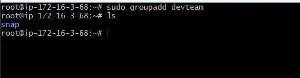
- Create users
```bash
sudo useradd -m -s /bin/bash akhil
sudo useradd -m -s /bin/bash john
sudo useradd -m -s /bin/bash priya
```
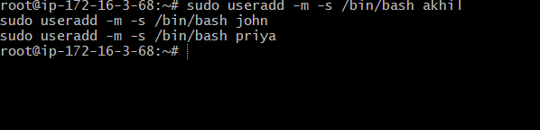
- Add users to the devteam group
```bash
sudo usermod -aG devteam akhil
sudo usermod -aG devteam john
sudo usermod -aG devteam priya
```
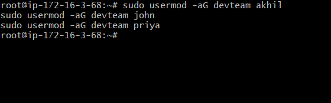
- Verify
```bash
groups akhil
```
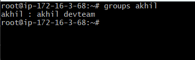
## 2. Manage permissions for project directories

- Create project directory
```bash
sudo mkdir -p /projects/app1

```

- Set group ownership
```bash
sudo chown -R :devteam /projects/app1

```
- Set correct permissions
```bash
Set correct permissions

```
- Verify
```bash
ls -ld /projects/app1

```
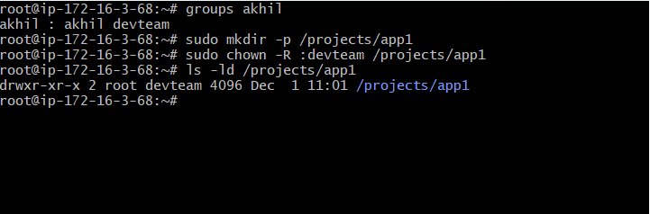
## 3. Install required packages (Git, Nginx, Java)
- Update system
```bash
sudo apt update -y
```
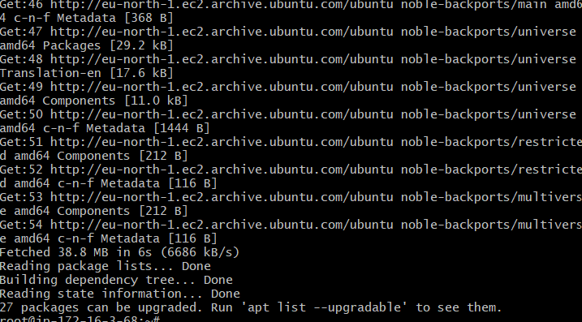
- Install Git
```bash
sudo apt install git -y
```
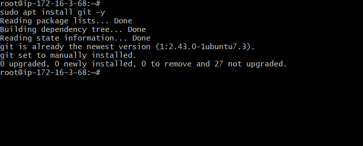
- Install Nginx
```bash
sudo apt install nginx -y
sudo systemctl enable --now nginx
```
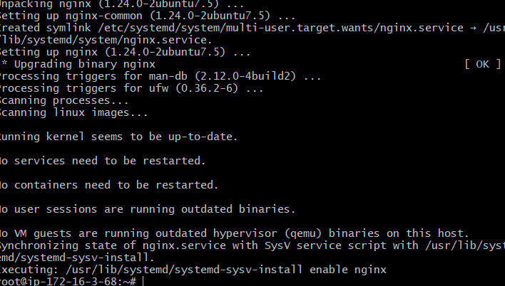
- Install Java
```bash 
sudo apt install openjdk-17-jdk -y
```

- Verify installations
```bash
git --version
nginx -v
java -version
```
## 4. Check system info (memory, CPU, disks)
- Memory
```bash
free -m
```
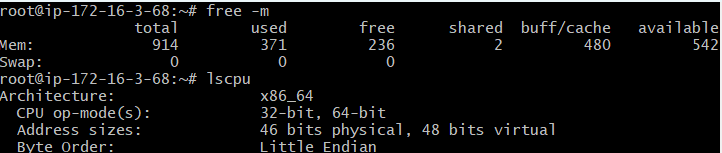
- CPU
```bash
lscpu
```
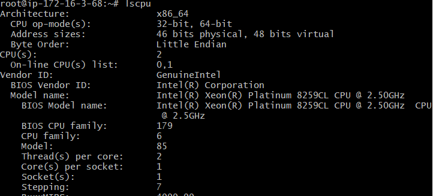
- Disk
```bash
df -h
```
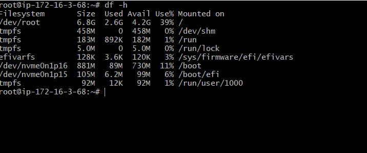
- OS Details
```bash
uname -a
cat /etc/os-release
```
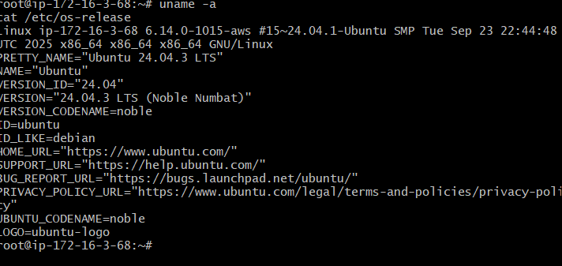
- Processes
```bash
top
```
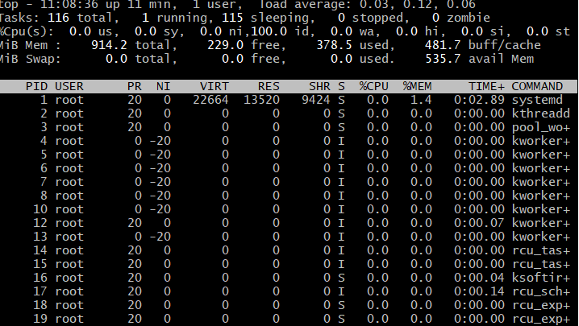
## Level 2 – Intermediate (Daily DevOps Tasks)
##  Automate backups with Cron
- Create a backup script
```bash
sudo mkdir -p /backups
sudo nano /usr/local/bin/backup.sh
```


- backup.sh
#!/bin/bash
tar -czf /backups/app1_$(date +%F).tar.gz /projects/app1
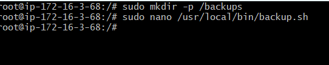


- Make script executable:
```bash
sudo chmod +x /usr/local/bin/backup.sh
```
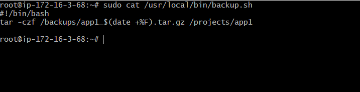

- Create a cron job (daily backup at 2 AM)
sudo crontab -e


- Add:
```bash
0 2 * * * /usr/local/bin/backup.sh
```
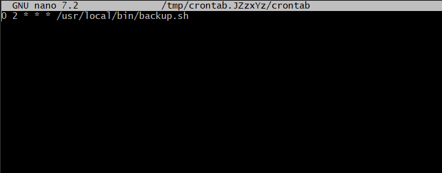
## Create essential shell scripts
- Log cleanup script
```bash
sudo nano /usr/local/bin/log_cleanup.sh
```
```bash
#!/bin/bash
find /var/log -type f -name "*.log" -mtime +7 -exec rm {} \;
```
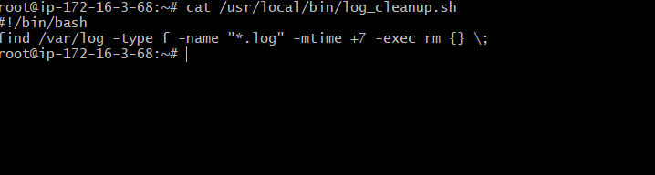
- Service restart script

```bash
sudo nano /usr/local/bin/restart_nginx.sh
```
```bash
#!/bin/bash
systemctl restart nginx
```
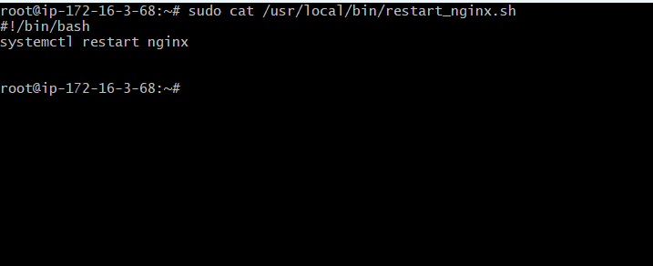
- Health check script
```bash
sudo nano /usr/local/bin/health_check.sh
```
```bash
#!/bin/bash
curl -I http://localhost
systemctl status nginx
```
- Make all scripts executable
```bash
sudo chmod +x /usr/local/bin/*.sh
```
## Manage logs under /var/log
- Check log size:
```bash
du -sh /var/log/*
```
- View logs
```bash
tail -n 100 /var/log/syslog
tail -f /var/log/nginx/access.log
```
- Clean old logs
```bash
sudo find /var/log -type f -mtime +7 -delete
```
## Monitor system performance & troubleshoot services
- Performance monitoring
```bash
top
htop    # if installed
free -m
vmstat 1 5
iostat
```
- Troubleshooting services
```bash
systemctl status nginx
journalctl -u nginx --since today
```
## Level 3 – Advanced (Production-Ready Linux Admin) – Clean Steps
## Create a custom systemd service
- Create service file
```bash
sudo nano /etc/systemd/system/myapp.service
```
- myapp.service
```bash
[Unit]
Description=My Custom Application
After=network.target

[Service]
ExecStart=/usr/bin/java -jar /projects/app1/app.jar
Restart=always
User=akhil
Group=devteam

[Install]
WantedBy=multi-user.target
```
- Enable & start service
```bash
sudo systemctl daemon-reload
sudo systemctl enable --now myapp.service
systemctl status myapp.service
```
## SSH Hardening
- Edit SSH config
```bash
sudo nano /etc/ssh/sshd_config
```
- Recommended secure settings
```bash
PermitRootLogin no
PasswordAuthentication no
PubkeyAuthentication yes
```
- Restart SSH
```bash
sudo systemctl restart sshd
```
## LVM Setup for Storage Scaling
- Identify disk
```bash
lsblk
```
- Create physical volume
```bash
sudo pvcreate /dev/xvdf
```
- Create volume group
```bash
sudo vgcreate datavg /dev/xvdf
```
- Create logical volume
```bash
sudo lvcreate -n applv -L 10G datavg
```
- Format & mount
```bash
sudo mkfs.ext4 /dev/datavg/applv
sudo mkdir /data
sudo mount /dev/datavg/applv /data
```
- Make permanent
```bash
echo "/dev/datavg/applv /data ext4 defaults 0 0" | sudo tee -a /etc/fstab
```
## Configure firewall rules
- Using UFW
```bash
sudo ufw allow ssh
sudo ufw allow 80/tcp
sudo ufw allow 443/tcp
sudo ufw enable
```
- Using firewalld
```bash
sudo firewall-cmd --add-service=http --permanent
sudo firewall-cmd --add-service=https --permanent
sudo firewall-cmd --reload
```
## Implement logrotate for app logs

- Create logrotate config
```bash 
sudo nano /etc/logrotate.d/myapp
```
```bash 
/projects/app1/logs/*.log 
    daily
    rotate 7
    compress
    missingok
    notifempty
```
- Test
```bash
sudo logrotate -d /etc/logrotate.d/myapp
```